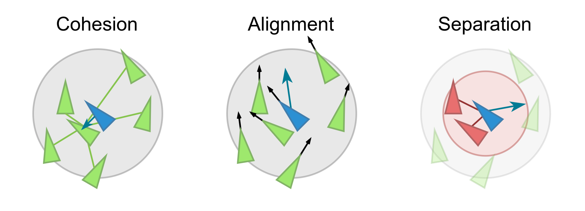
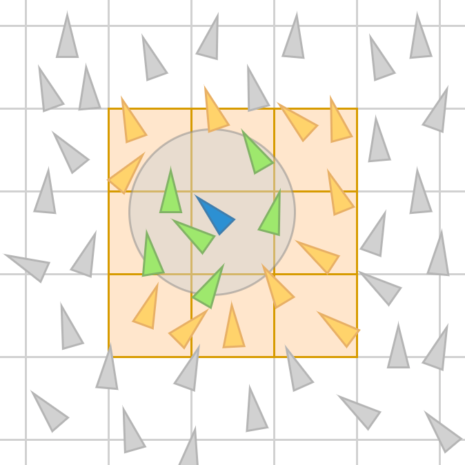
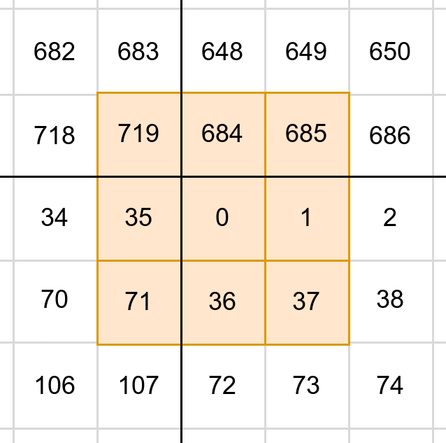
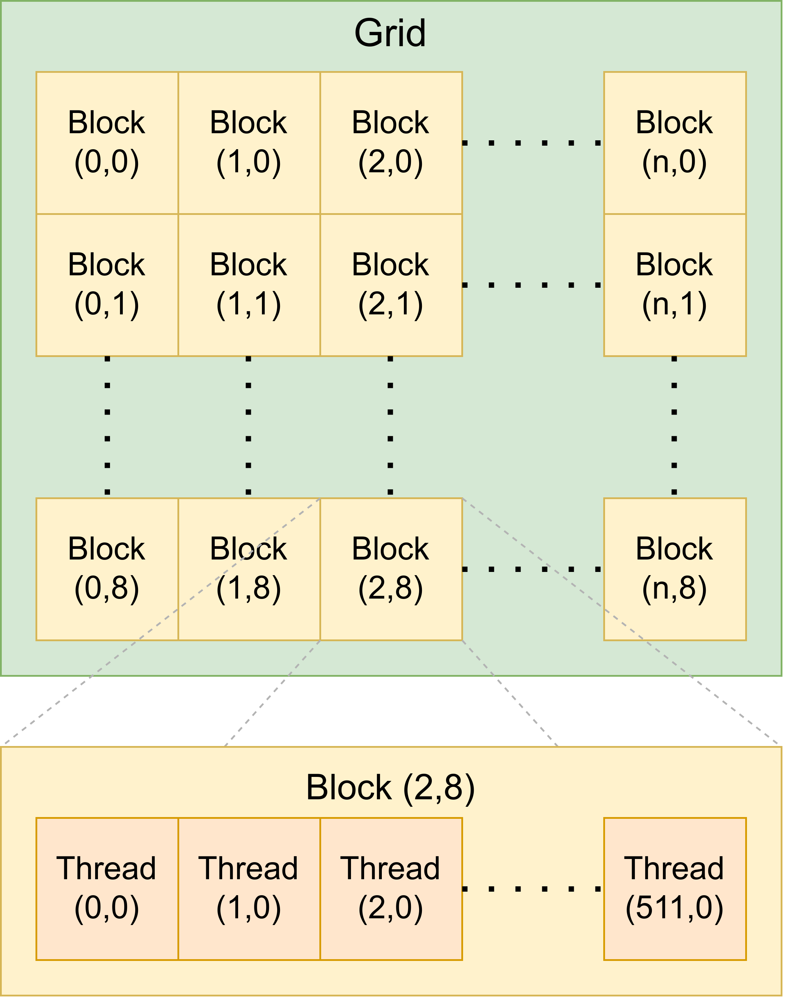

# Boids Simulation
*Boids* is a classic artificial life simulation in which collective flocking behaviour can emerge from the interaction of agents following simple rules. The Boids model applies three rules: 

 - Cohesion : steer towards the average position of its neighbors, seeking to become part of the group
 - Alignment : follow the general direction of its neighbors
 - Separation : move away from agents that get too close, seeking to respect a "personal bubble" and avoid overcrowding (or collisions)

    
     Figure 1 – The 3 fundamental rules 

An important aspect of this model is how agents evaluate their velocity depending on the behavior of local flockmates. When an agent evaluates its peers, it only considers a certain portion of the flock, i.e. agents within a certain radius (called *neighbors*). Thus, as they move, all boids will individually evaluate their own *neighborhood* and readjust their direction.

The evaluations for each boid are independent of each other and can therefore be computed simultaneously. A large population of agents can lead to a large amount of computation, so there is a huge advantage to using parallelism in the implementation of this simulation. The solution presented here exploits parallelism to simulate a population of boids that can reach hundreds of thousands using modern hardware.

# Implementation
One of the main steps in computing the direction of boids is the *neighbor search*, i.e. when an agent must evaluate which of its peers are its neighbors. A naive implementation would involve considering each peer one by one and calculating the distance between each other to determine if they are within the neighborhood radius, which results in a time complexity of O(n2). With a large population, this implementation would prove inefficient, even with parallelization.

### Spatial Partitioning
One solution to this problem is to use spatial partitioning. The simulation space is thus divided into cells distributed on a grid. This grid is used to identify the position of each agent and associate them to a certain cell. The size of the cells is determined in accordance with the radius of the boids' neighborhood area. The neighbors of an agent will therefore always be found within the block of 9 cells at the center of which the agent is located. This technique significantly reduces the average time required for the neighbor search and also gives a new opportunity to exploit space as a data structure.

    
     Figure 2 – Spatial partitioning : agents only consider flockmates that are positioned in the adjacent cells to evaluate which of them are their neighbors 

### Wrap-Around
The simulation features a *wrap-around* mechanism, which consists of connecting the opposite edges of the grid in order to be able to loop infinitely through the simulated space. On a wrap-around grid, an agent reaching the right boundary would appear on the left side, and if it would reach the lower boundary, it would reappear at the top of the grid. The space of the simulation thus has a toroidal topology. This feature is optional but has some impact on the implementation, namely when it comes to calculating the distance between two agents.

    
     Figure 3 – Wrap-around edges on the spatial partitioning grid (using a 36 x 18 grid in this example) 

### Neighbor search
Using a partitioned grid, an agent will look for neighbors in 9 cells, i.e. its current cell and the 8 other cells surrounding it.
As shown in Figure 3 above, a cell can have adjacent cells over the edge of the grid. When searching for neighbors, an agent will thus search in specific cells depending on which one it is on. Instead of constantly performing operations to find the indexes of the neighboring cells, a lookup table can be created at the beginning of the simulation and consulted by the agents, thus saving precious computation time. 

After identifying the neighboring cells, an agent must then evaluate which of its peers are in those cells. To do so, several buffers are used to keep track of boid positions and cell indexes. Using some sorting and pointer chasing, the agent can efficiently obtain a list of every flockmate which is candidate to be a neighbor. Then, the agent must determine if these candidates are actual neighbors by measuring the distance between the two of them. If so, the three rules are applied and the agent adapts its trajectory to the data collected from its neighborhood. 

### Parallelization
It is relevant to note that the calculations for each agent is independent. The search can therefore be parallelized with a number of threads equal to the population size. Most kernels in the program therefore use 1D indexing, with a thread for every agent, distributed in blocks of 512 threads. 

As for the neighbor search, the calculations in each of the 9 cells for the same agent are also independant. The kernel will thus be executed by a number of threads threads totaling 9 times the population size. This kernel uses 2D indexing, where the population is distributed along the X axis and the search in each of the 9 neighbor cells along the Y axis.

    
     Figure 4 – Distribution of threads for the neighbor search kernel 

Given the nature of the simulation, the agents do not share memory. The blocks are not distributed in a way to increase performance but to facilitate kernel invocation and indexing.
